# store_management_system
This is University assignment. This is a Java project of creating a store management system where user able to view stock, add stock, deduct stock, discontinue stock and create stock.
  This project uses javaFX to build the user interface.
  This project is to test oop concept and use of java language.

* [Login page](#loginpage)
* [Product quantity](#productquantity)
* [Option page](#optionpage)
* [View stock](#viewpage)
* [Add stock](#addstock)
* [Deduct stock](#deductstock)
* [Discontinue stock](#discontinuestock)
* [Create Product](#createprodcut)

  

  
 This is login page, where user need to key in the name.

  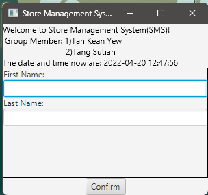
    
  

  

  

  
 This is product quantity page, where user need to enter the product quantity that will be added in store.

  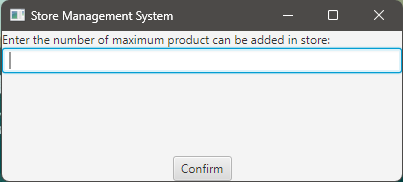
    
  

  

  

  
 This is option page, where user can choose different function.

  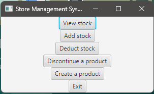
  

  

  

 This is view page where user able to select the product and able to check the product information.

    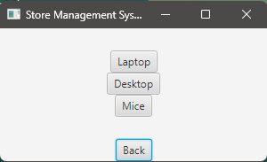
    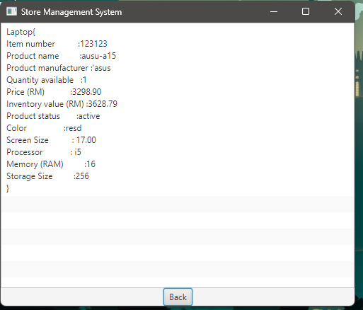
  

  

 This is add stock page where user able to select the product and add the quantity of product.

    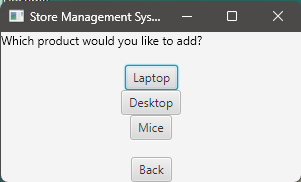
    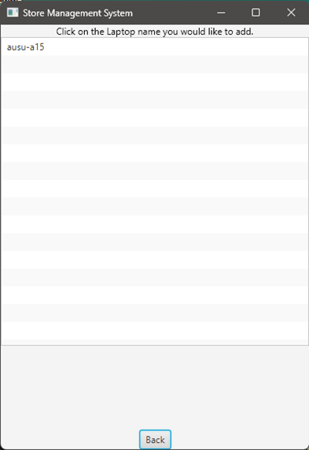
    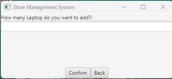
  

  

  

 This is add deduct page where user able to select the product and deduct the quantity of product.

    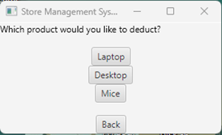
    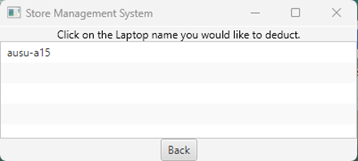
    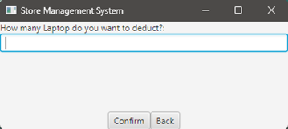
  

  

 This is add discontinue page where user able to select the product and disable the status of product.

    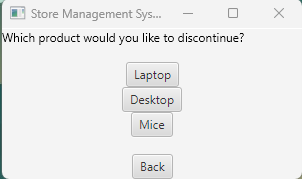
    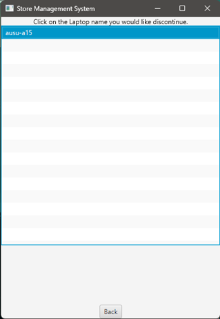
  

  

  

 This is create product page where user able to create product. 

    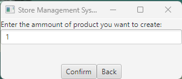
    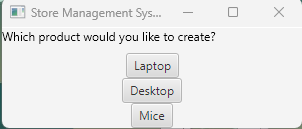
    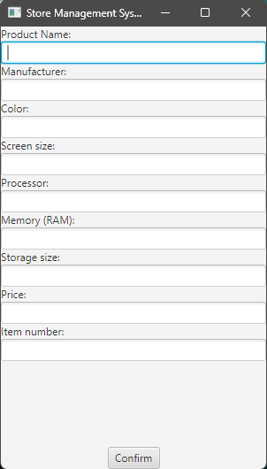
  

